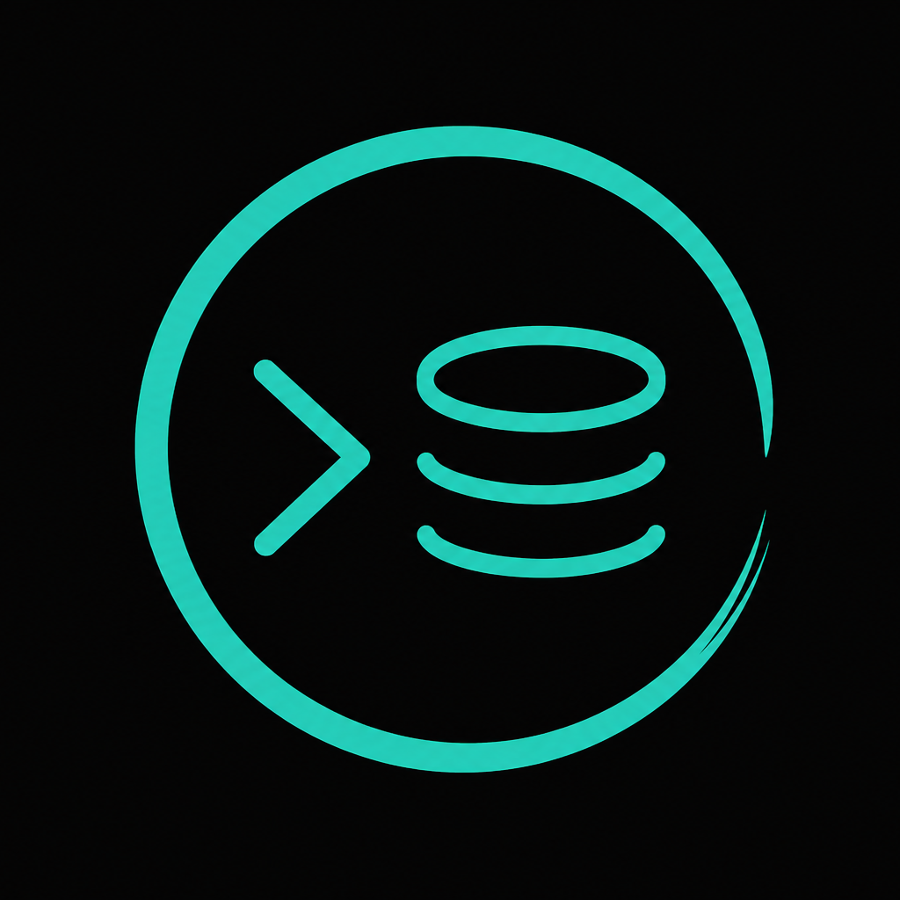

# mindb

<p align="center">
  
</p>

AI-powered PostgreSQL client with a terminal-like UI for iOS and desktop.

## Setup

1. Install [Flutter](https://docs.flutter.dev/get-started/install) (stable, Dart 3.6+).
2. From the project root:

```bash
flutter pub get
dart run build_runner build --delete-conflicting-outputs
flutter run
```

3. Open **Settings** and add your OpenAI, Anthropic, or Kimi API key.
4. Add a connection (host, port, database, credentials) and start a session.

## Test Postgres with Docker

```bash
docker run --name mindb-pg -e POSTGRES_PASSWORD=postgres -p 5432:5432 -d postgres:16
```

Use `localhost:5432`, database `postgres`, user `postgres`, password `postgres`.

## iOS App Transport Security

mindb connects directly to PostgreSQL over TCP. For local or non-TLS databases, iOS blocks cleartext HTTP/TCP by default. `ios/Runner/Info.plist` sets `NSAppTransportSecurity` → `NSAllowsArbitraryLoads` to `true` so non-TLS database connections work during development.

For production, prefer SSL-enabled Postgres (`Use SSL` in the connection form) and tighten ATS exceptions.

## iOS device install

The Xcode project uses **automatic signing** with team `7Y2EHDSMDJ` (personal Apple ID) and bundle ID `app.mindb.mindb`.

If install fails with a missing provisioning profile:

1. Connect the iPhone and unlock/trust the Mac.
2. Open `ios/Runner.xcworkspace` in Xcode.
3. Select the **Runner** target → **Signing & Capabilities**.
4. Confirm **Automatically manage signing** is enabled and your personal team is selected.
5. Build once from Xcode (`Product → Run`) so the device is registered and a profile is created.
6. Run again from Flutter: `flutter run -d <device-id>`.

### iOS 26+ debug crash (JIT)

On physical devices running **iOS 26+**, `flutter run` in **debug** mode can crash at startup with:

```text
Crash occurred when compiling unknown function in unoptimized JIT mode
```

Apple blocks in-process JIT on newer iOS releases. This project uses Flutter **3.27.1**, which predates the engine fix for that restriction.

**Workarounds (pick one):**

| Goal | Command |
|---|---|
| Run on Genos now | `flutter run --profile -d Genos` or `flutter run --release -d Genos` |
| Debug + hot reload | Use the iOS Simulator, or upgrade Flutter to latest stable |
| Upgrade Flutter (fixes debug on device) | `flutter upgrade` then `flutter run -d Genos` |

Profile/release use ahead-of-time (AOT) compilation and do not hit the JIT crash.

## Architecture

- **Drift** — connection profile persistence
- **flutter_secure_storage** — passwords and LLM API keys
- **postgres** — direct PostgreSQL client
- **Riverpod + go_router** — state and navigation
- **SafetyPolicy** — SQL classification, read-only mode, LIMIT injection
- **AiAgentOrchestrator** — LLM tool loop (`get_schema`, `execute_sql`, `explain_sql`)
- **LLM providers** — OpenAI, Anthropic, Kimi (Moonshot, OpenAI-compatible API)

## Direct SQL

Prefix input with `sql:` to run raw SQL, e.g. `sql: SELECT 1`.

## Tests

```bash
flutter test
flutter analyze
```
